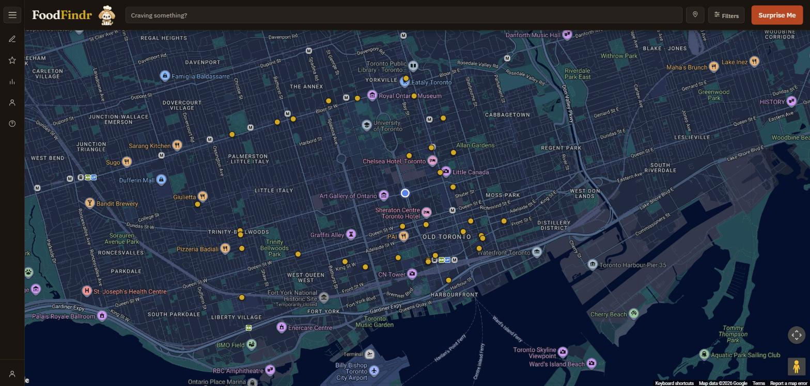
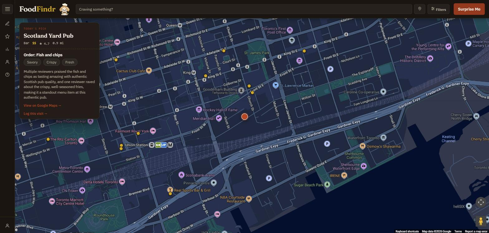
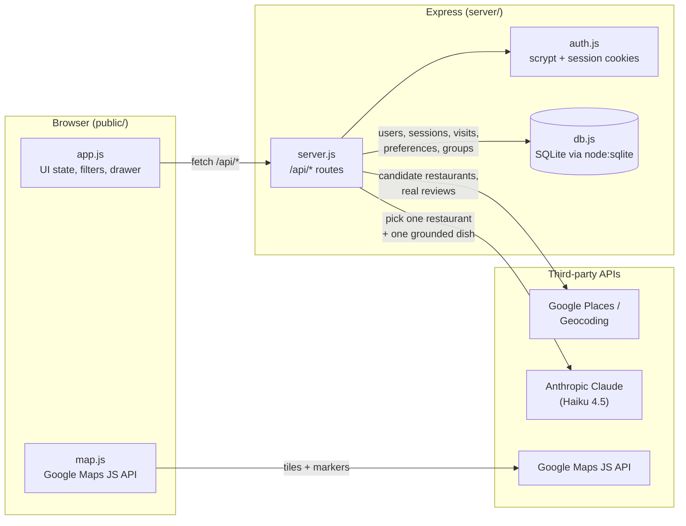

# FoodFindr

FoodFindr is a restaurant-recommendation web app that picks one restaurant and one
specific dish based on your budget, cuisine, group size, and location, then has
Claude read real Google reviews to justify the pick instead of guessing at a menu.
It also tracks where you've actually eaten and gamifies exploring your city.
Solo project, built in about two weeks.

**Try it live at [foodfindr.tech](https://foodfindr.tech)**: sign up or continue as a guest, no setup required.

<p align="center">
  
  
</p>

## Features

- AI-picked restaurant and dish recommendations, grounded in real reviews (never an invented menu item)
- Interactive dark-mode Google Maps view with custom markers and a location picker
- Personalized taste profiles: favorite cuisines, dietary restrictions, spice/price tolerance
- Group sharing mode: several dishes sized to a computed total budget
- Visit logging with 1-5 star ratings
- Exploration progress, visit streaks, achievement badges, and a friends leaderboard
- Guest mode: search and get a recommendation with no account

Full route list and file-by-file breakdown: [docs/ARCHITECTURE.md](docs/ARCHITECTURE.md).

## How it's built



A search round-trip: pick a location → `GET /api/restaurants` asks Google
Places for nearby (or text-searched, if a cuisine/dish/dietary hint is set)
candidates → up to 8 of the highest-rated go to `POST /api/recommend`, which
pulls each one's real reviews from Places and asks Claude to pick one and
name a specific dish the reviews actually back up, personalized by saved
preferences, recent visits, and (if searching as a friend group) everyone's
combined data. Nothing about the pick is invented: if the reviews don't
mention a specific dish, Claude says so instead of guessing.

## How to use it

1. Sign in, or continue as guest.
2. Set your location (defaults to real GPS, or search/drop a pin instead).
3. Type a craving, or open Filters for price/cuisine/distance/group size.
4. Hit Surprise Me for one restaurant and one dish, backed by real reviews.
5. Log your visits to build your taste profile and track exploration progress.

## Design decisions

- Google Places doesn't expose menu/dish data, so Claude reads real review text
  to suggest a dish, and says so plainly instead of inventing one when the
  reviews don't back it up.
- Price filtering treats Google's 0-4 scale as a ceiling, not an exact match,
  since it doesn't map one-to-one onto a 3-tier UI.
- Dietary restrictions are a best-effort instruction to Claude, not a hard
  filter, since Places has no ingredient/allergen data.

## Challenges

- Started the map on Leaflet (a free, open-source library) for the first
  working prototype, then swapped it for the Google Maps JS API once real
  location data came in, a full library change on day one.
- Adding accounts meant turning `preferences` from a single global row
  (enforced by a `CHECK (id = 1)` constraint) into a per-user table. SQLite
  can't `ALTER TABLE` around a `CHECK` constraint or re-key a table, so the
  fix was to rename the old table, create a fresh per-user one, and have the
  first real signup automatically adopt whatever data already existed.
- `/api/restaurants` used to silently fall back to a hardcoded "Mock City"
  location whenever geolocation failed. It worked, but it was dishonest, so
  it was replaced with a real empty state that asks for a location instead of
  faking one.
- Auth is hand-rolled (`node:crypto` scrypt hashing, opaque session tokens, a
  small custom cookie parser) instead of pulling in Passport.js, to keep the
  dependency list at zero beyond Express itself.

## Future work

- Better recommendation ranking beyond "top-rated candidate Claude picks from"
- Richer restaurant metadata than what Places exposes (hours, structured menus)
- A true city-wide exploration total instead of "restaurants FoodFindr has shown you"
- Multi-city support for progress tracking and the leaderboard

## Built with

Node.js + Express on the backend, vanilla JS/HTML/CSS on the frontend (no
framework, no build step), SQLite via Node's built-in `node:sqlite` (zero
extra dependencies), the Google Maps JavaScript API, Google Places and
Geocoding APIs, and Anthropic's Claude for the recommendation itself.
Deployed on Azure App Service with GitHub Actions.

## Project structure

```
FoodFindr/
├── public/    # frontend: HTML/CSS/vanilla JS, map + UI logic
├── server/    # Express server, auth, routes, SQLite access
├── docs/      # architecture and deploy detail, out of this README's way
└── package.json
```

## Run it locally

The steps below are for running or modifying the code yourself (they're not
needed just to use the live site above).

```bash
npm install
npm start
```

Then open http://localhost:3000

### API keys

The live site already has these configured. You'd only need your own if
running the code locally or deploying your own copy. This app calls four
real APIs; copy `.env.example` to `.env` and fill in:

- `GOOGLE_MAPS_BROWSER_KEY`: Google Cloud Console key restricted to the Maps JavaScript API, sent to the browser.
- `GOOGLE_MAPS_MAP_ID`: a Map ID (Maps Platform → Map Management) with a dark-mode style associated, used for the custom markers.
- `GOOGLE_PLACES_SERVER_KEY`: a server-only key, never sent to the browser. Its API restrictions must include both **Places API** and **Geocoding API**.
- `ANTHROPIC_API_KEY`: from console.anthropic.com, used for the AI recommendation.

`DB_PATH` is optional: set it to point the SQLite file at a mounted disk in
production (e.g. `/data/foodfindr.db`); defaults to `server/foodfindr.db`
locally. No session-secret env var is needed: sessions are opaque random
tokens looked up in the database, not signed or encrypted cookies.

Without these, the app still runs: the map shows a placeholder message and
restaurant/recommendation/progress requests return friendly errors or hide
themselves instead of crashing.

## Deploying

Deployed on Azure App Service (Basic B1) via the GitHub Student Developer
Pack, chosen because it's the rare option offering persistent disk storage
(needed for the SQLite file) without a serverless host's cold-start
limitations or requiring a credit card up front. Full step-by-step setup is
in [docs/DEPLOYING.md](docs/DEPLOYING.md).
